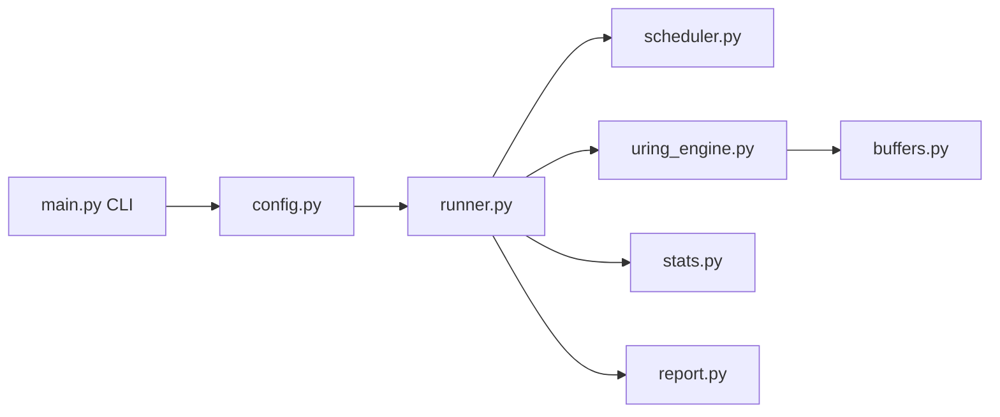

# План реализации MixedIOTester (Python + io_uring)

## 1) Архитектура и технологический выбор

- Выбрать интеграцию с `io_uring` через `ctypes` к `liburing` (Linux-only), с тонким адаптером в `uring_engine.py`.
- Причина выбора: контролируемый low-level доступ к SQE/CQE и queue depth без лишнего абстракционного overhead, при этом без обязательной сборки отдельного C-extension на MVP-этапе.
- Разделить систему на:
  - **Control plane (Python):** конфиг, валидация, scheduler, lifecycle, статистика, отчёты.
  - **Data plane (io_uring):** submit/poll completions, metadata request’ов, буферы.

## 2) Целевая структура проекта

- [C:/Users/levma/PycharmProjects/MixedIOTester/main.py](C:/Users/levma/PycharmProjects/MixedIOTester/main.py) — CLI entrypoint (`--config`, `--override`, `--dry-run`, `--print-effective-config`).
- [C:/Users/levma/PycharmProjects/MixedIOTester/config.py](C:/Users/levma/PycharmProjects/MixedIOTester/config.py) — загрузка YAML/JSON + валидация ТЗ.
- [C:/Users/levma/PycharmProjects/MixedIOTester/model.py](C:/Users/levma/PycharmProjects/MixedIOTester/model.py) — dataclass/enum модели: op types, config, request metadata, stats snapshots.
- [C:/Users/levma/PycharmProjects/MixedIOTester/scheduler.py](C:/Users/levma/PycharmProjects/MixedIOTester/scheduler.py) — fixed-mix scheduler (по issued), random/sequential offsets.
- [C:/Users/levma/PycharmProjects/MixedIOTester/buffers.py](C:/Users/levma/PycharmProjects/MixedIOTester/buffers.py) — aligned buffer pool, reuse буферов разных размеров.
- [C:/Users/levma/PycharmProjects/MixedIOTester/uring_engine.py](C:/Users/levma/PycharmProjects/MixedIOTester/uring_engine.py) — FFI вызовы `liburing`, submit/completion loop primitives.
- [C:/Users/levma/PycharmProjects/MixedIOTester/stats.py](C:/Users/levma/PycharmProjects/MixedIOTester/stats.py) — per-op/total counters, latency percentiles, achieved mix.
- [C:/Users/levma/PycharmProjects/MixedIOTester/runner.py](C:/Users/levma/PycharmProjects/MixedIOTester/runner.py) — warmup/main/drain lifecycle, Ctrl+C graceful stop.
- [C:/Users/levma/PycharmProjects/MixedIOTester/report.py](C:/Users/levma/PycharmProjects/MixedIOTester/report.py) — console summary + JSON/CSV экспорт.
- [C:/Users/levma/PycharmProjects/MixedIOTester/examples/workload.yaml](C:/Users/levma/PycharmProjects/MixedIOTester/examples/workload.yaml) — пример конфигурации.
- [C:/Users/levma/PycharmProjects/MixedIOTester/tests/](C:/Users/levma/PycharmProjects/MixedIOTester/tests/) — unit/smoke тесты по ТЗ.

## 3) Поведение MVP (scope)

- Linux + `io_uring`, 1 процесс, 1 ring, 1 scheduler.
- Операции: `RR`, `RW`, `SR`, `SW`, каждая со своим `block_size`, `share`, `enabled`.
- `queue_depth` поддерживается постоянно (без rate throttle).
- Mix трактуется **по числу issued операций**; completed mix считается отдельно.
- Warmup (`warmup_sec`) без учёта в main-метриках, затем main run (`runtime_sec`), затем drain.
- Target: `file` (с create_if_missing) и `block_device`.
- `direct=true/false`; при `direct=true` валидируется alignment для block/offset.

## 4) Scheduler и offset-логика

- Алгоритм fixed-mix:
  - хранить `issued_count[op]`, `total_issued`.
  - считать `expected = total_issued * target_share`.
  - выбирать op с максимальным `deficit = expected - issued_count`.
- Sequential pointers:
  - отдельные указатели `SR` и `SW`.
  - шаг = `block_size` конкретной операции.
  - циклический wrap в пределах `[region_start, region_end)`.
- Random offsets:
  - выбор внутри допустимого диапазона с учётом `block_size` и alignment.
  - гарантия `offset + block_size <= region_end`.

## 5) Метрики и формат отчётов

- Per-op: issued/completed, bytes, IOPS, bandwidth, avg/min/max, p50/p95/p99, errors.
- Total: общие issued/completed/bytes, total IOPS/BW, latency percentiles, runtime.
- Achieved mix: отдельно по issued и completed.
- Output:
  - console summary;
  - JSON (full config + summary + per-op + percentiles + env/timestamp/errors);
  - CSV (per-op агрегаты + total).

## 6) Тестовая стратегия

- Unit: `scheduler` (mix convergence, fairness по issued).
- Unit: `config` validation (shares, alignment, region, runtime, qd).
- Unit: offset generation (random bounds + sequential wrap).
- Smoke: короткий запуск (мок/фейк engine для CI-friendly теста).
- Пропорции mix: тест отклонения фактического issued mix от target в длинном прогоне scheduler.

## 7) Ограничения MVP и следующий этап

- Ограничения MVP:
  - single ring / single process;
  - latency percentiles — через хранение latency sample в памяти (без HDR histogram).
- Следующий этап:
  - per-op outstanding limits;
  - multi-worker/rings;
  - time-series CSV snapshots;
  - histogram-бакеты и memory-efficient percentile path;
  - verify patterns / fsync modes / CPU pinning.

